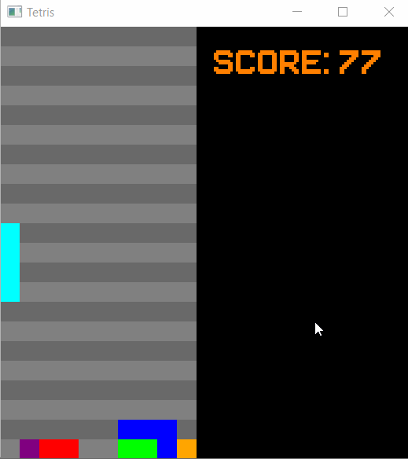

# Tetris
## Description

C'est un simple jeu Tetris.
Voici les contrôles :

| Touche | Description |
|--------|-------------|
| "z" | rotation de la pièce |
| "q" et "d" | permet le déplacement à gauche et à droite |
| "s" | accélère la chute d'une pièce (fait gagner des points) |

A chaque fin de partie le jeu ce relance après 5 seconds.

## Fonctionnement

Le jeu a été fait en C++ avec la bibliothèque [SFML](https://www.sfml-dev.org/).
Le code a été compilé et crée sur Windows 10 avec MinGW-W64 8.